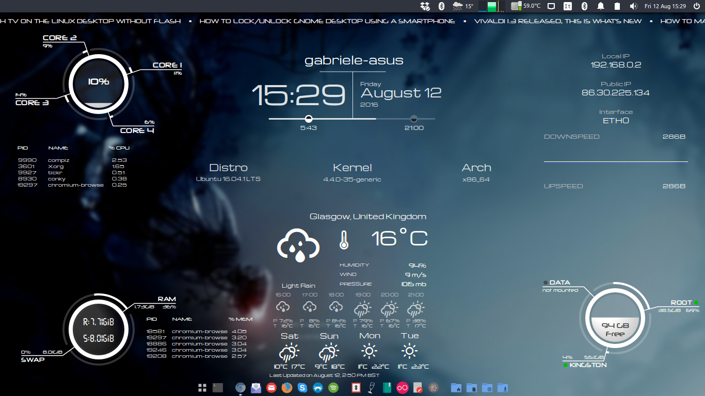

# New Life

New Life is a series of customisable scripts for Conky 1.10 and above, written by Gabriele N. Tornetta.

The current stable release version is **1.0**.

Copyright © 2016 Gabriele N. Tornetta. All rights reserved.

All the files that make up the project are distributed under the GPL.

## Description

New Life comes with 6 highly customisable widgets for your desktop. The name of the files and of the widgets should be self-explanatory enough, however here are some brief descriptions.

**N.B.:** A file marked with "(conf)" holds the widget's configuration parameters.

#### CPU

Files  
`scripts/cpu`  
`lua/cpu.lua` (conf)

Monitors the load on each core and provides the overall usage in the middle of the ring. The top 5 processes by CPU consumption are also displayed.

#### File System

Files  
`scripts/fs`  
`lua/fs.lua` (conf)

Monitors the usage of the specified file systems and provide the overall storage available.

#### Info

Files  
`scripts/info`  
`lua/info.lua` (conf)

Displays system information, like the node name, current time and date, day progress with sunset and sunrise marks, and other data, such has the distributon name, kernel version, architecture etc... The displayed information can be customised to some extent (see _How to Configure_)

#### Memory

Files  
`scripts/mem`  
`lua/mem.lua` (conf)

Displays RAM and SWAP usage as well as the total amount of the two available on the machine.

#### Network

Files  
`scripts/net` (conf)

Monitors two network interfaces, displaying the most relevant parameters of the first active one.

#### Weather Underground

Files  
`scripts/wu`  
`lua/wu.lua`  
`python/wu.py` (conf)

Displays current conditions relative to the currently specified location in `python/wu.py`. To prevent going over the limits of a free Wundergroun API key, the request is not sent by the widget. To ensure that the weather information is updated, the script `python/wu.py` must be executed periodically (e.g. by registering it with `crond`, see _How to Configure_).

## How to Install

New Life comes with a set of Conky, Lua and Python scripts, together with 4 free fonts (DJB Get Digital, Michroma, Neuropol and Weather Icons, copyright to the respective authors). The following installation instructions have been tested on Ubuntu 16.04 LTS using Python 2.7, Lua 5.2 and Conky 1.10.1.

New Life depends on
* python 2.7
* conky >= 1.10
* lua >= 5.0

On Ubuntu 16.04, you can install the dependencies with
~~~~
$ sudo apt install conky lua53 python2.7
~~~~

Install the fonts by moving the `.ttf` files into `~/.fonts`. If the folder doesn't exist, create it. Then force a font cache update with
~~~~
$ fc-cache -fv
~~~~

Place the rest of the files wherever you want (e.g. `~/.conky`). Activate and customise the widgets that you want to appear on your desktop (see _How to Configure_ below). Give the bash script `start.sh` permission to execute (`chmod +x start.sh`) and run it with `./start.sh` from within the folder containing it. Use this script in _Startup Applications_ from the Ubuntu dash if you want to launch it automatically at boot.

## How to Configure

There isn't much to configure as most of the widgets will work out of the box. The estimated configuration time is probably below 5 minutes.

To enable or disable some widgets, open the `start.sh` script and comment out any widget you don't want to launch. If you don't want the weather widget, you should also comment out the python command.

For example, if you only want to monitor File Systems and the CPU, your `start.sh` should look like this
~~~~
cd "$(dirname "$0")" ;
# python python/wu.py -d ;
conky -c scripts/cpu ;
# conky -c scripts/info ;
# conky -c scripts/mem ;
conky -c scripts/fs ;
# conky -c scripts/net ;
# conky -c scripts/wu
~~~~
If you also want to use the weather widget, uncomment the python line and the last one,
~~~~
cd "$(dirname "$0")" ;
python python/wu.py -d ;
conky -c scripts/cpu ;
# conky -c scripts/info ;
# conky -c scripts/mem ;
conky -c scripts/fs ;
# conky -c scripts/net ;
conky -c scripts/wu
~~~~

#### CPU

For the CPU widget one needs to specify the number of cores to display. Open `lua/cpu.lua` and change the value of the variable `cores` accordingly. The default value is `4` (e.g. a dual-core architecture).

#### File System

To configure the File System widget, open `lua/fs.lua` and change the table `fs`, which contains pairs of file system and labels. If you want to monitor the root file system `/` and any other partition mounted at, e.g., `/media/DATA`, the variable `fs` should look like
~~~~
fs = {
    {'/', "ROOT"},
    {'/media/DATA', "DATA"}
}
~~~~

#### Info

Displays current date and time by default, plus additional information controlled by the variable `info`. Like the File System widget, this contains pairs of conky command and label. For example, to display the name of the current distribution and the kernel version, your `info` variable should look like this
~~~~
info = {
    {"${exec lsb_release -d | cut -f 2}",   "Distro"},
    {"${kernel}",                           "Kernel"}
}
~~~~

The variable `progress` controls whether to draw a progress bar that represents the advancement over the current day. It features the time for the sunset and the sunrise, therefore it requires some of the functionalities of the weather widget (see below). If you decide to set this variable to `1`, it is advisable that you leave the python line uncommented in the `start.sh` script and that you follow the instructions to schedule the python script with cron of the _Weather Underground_ section below.

#### Memory

There shouldn't be much to configure here as the purpose of this widget is to display the status of the RAM and the Swap partition. If you do not have a Swap partition, remove the corresponding entry from the `mem` table of `lua/mem.lua`.

#### Network

Currently, this is a pure conky script widget. By default it only look for the interfaces `eth0` and `wlan0` (exclusively, in the sense that if `wlan0` is detected then `eth0` is ignored). If your interfaces have different name then you can just do a Find & Replace with your favourite text editor (also look for the uppercase `WLAN0` and `ETH0` labels and change them accordingly).

Other changes that probably need to be done are the graph scales. These can be determined with, e.g., the value provided by speedtest.net. Conver them from Mbps to KBps with the formula
~~~~
KBps = 128 * Mbps
~~~~
and change the graph scales accordingly.

#### Weather Underground

As many weather conky configurations, Weather Underground requires you to have an account with an online weather forecast service. In this case the service is [Wunderground][wunder] and you need to register an API key (you can do this for free but there will be some (non-serious) limits on the queries you can perform over the day).

Once you have obtained an API key you can strat configuring the widget by opening up `python/wu.py` and changing the configuration variables at the beginning of the file. The first one is `wu_api_key` which is meant to hold your API key as a string. The next two variables are `country` and `city`. If you want the weather forecast for, e.g., Glasgow, United Kingdom, these variables will look like
~~~~
country = "UK"
city = "Glasgow"
~~~~

The last variable, `features`, tells the script which features to ask to the Wunderground server. The default value, `features    = ["conditions", "forecast10day", "astronomy"]`, has the minimum amount of features that allow both the Info and the weather widget to work to their full extent. In many cases you won't need to change this.

In order for the widget to display updated weather conditions for the current location, the python script `python/wu.py` needs to be called periodically with the `-d` flag in order to send a request for a new json file. One way of achieving this is by adding a task to `crond`. From a terminal, type `crontab -e` to start editing your `crond` table. Include the following lines at the end of the buffer
~~~~
# Update Weather Forecast from Wunderground (dest: /tmp/wu.json) every 15 mins
0-59/15 * * * * python /path/to/python/wu.py -d
~~~~
Replace `/path/to` with the actual path to the folder containing the `start.sh` script and save the buffer. This will update the json file, located at `/tmp/wu.json`, every 15 minutes. This value is chosen to be well within the limits of a free account with Wunderground. If you feel that you want more frequent updates then replace the `15` in `0-59/15` with any other number of minutes you like.

[wunder]:http://www.wunderground.com
